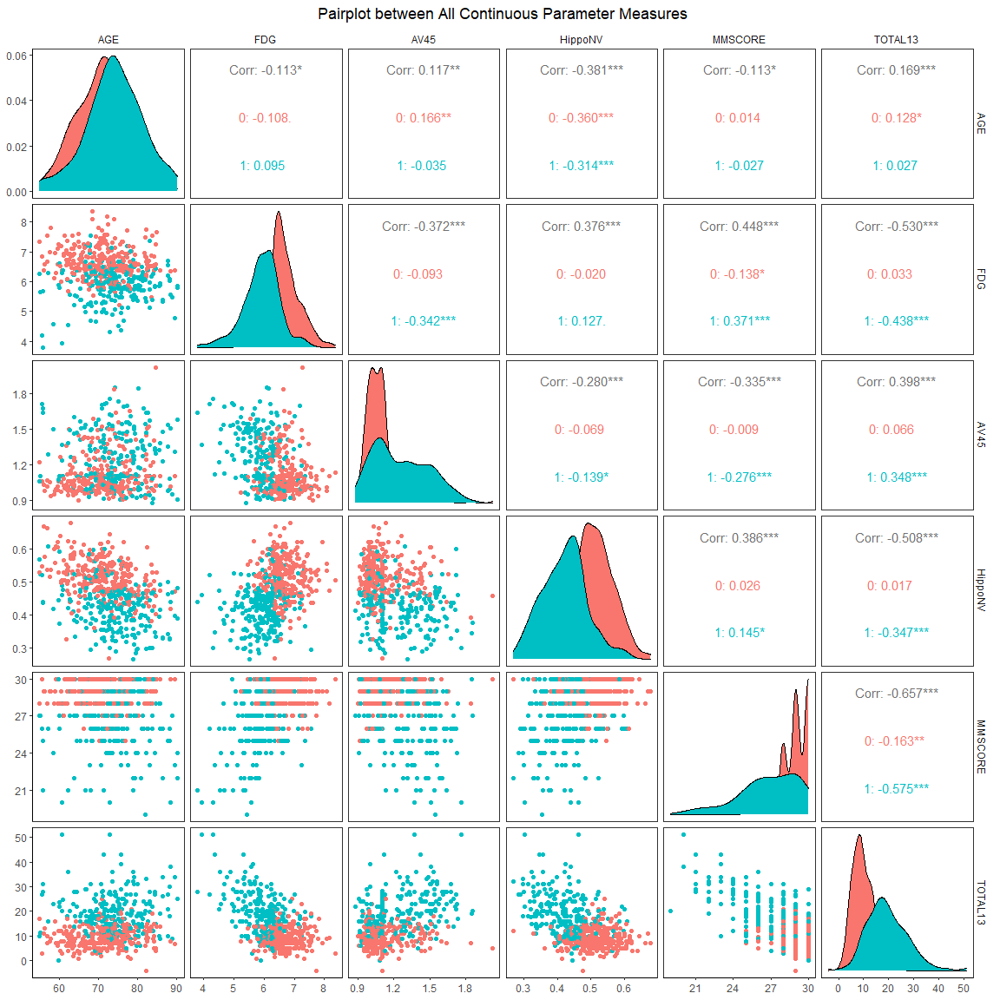

# INTRODCTION

In this Data Analysis Project, I am going to work with **Alzheimer's Disease(AD) and Factors affecting it**. The Project will mainly be focused around building a **Logistic Regression Model** to fit to the data.

## MOTIVE

-   To understand how the parameter levels, scores and factors affect a person, in terms of them having AD or not.

## DATA OVERVIEW

Let's take a look at the Data

<table class="table" style="margin-left: auto; margin-right: auto;">
<caption>First few rows of AD Data</caption>
 <thead>
  <tr>
   <th style="text-align:right;"> DX_bl </th>
   <th style="text-align:right;"> AGE </th>
   <th style="text-align:right;"> PTGENDER </th>
   <th style="text-align:right;"> PTEDUCAT </th>
   <th style="text-align:right;"> FDG </th>
   <th style="text-align:right;"> AV45 </th>
   <th style="text-align:right;"> HippoNV </th>
   <th style="text-align:right;"> e2_1 </th>
   <th style="text-align:right;"> e4_1 </th>
   <th style="text-align:right;"> rs3818361 </th>
   <th style="text-align:right;"> rs744373 </th>
   <th style="text-align:right;"> rs11136000 </th>
   <th style="text-align:right;"> rs610932 </th>
   <th style="text-align:right;"> rs3851179 </th>
   <th style="text-align:right;"> rs3764650 </th>
   <th style="text-align:right;"> rs3865444 </th>
   <th style="text-align:right;"> MMSCORE </th>
   <th style="text-align:right;"> TOTAL13 </th>
   <th style="text-align:right;"> ID </th>
  </tr>
 </thead>
<tbody>
  <tr>
   <td style="text-align:right;"> 0 </td>
   <td style="text-align:right;"> 71.7 </td>
   <td style="text-align:right;"> 2 </td>
   <td style="text-align:right;"> 14 </td>
   <td style="text-align:right;"> 6.82111 </td>
   <td style="text-align:right;"> 1.105695 </td>
   <td style="text-align:right;"> 0.5292994 </td>
   <td style="text-align:right;"> 1 </td>
   <td style="text-align:right;"> 0 </td>
   <td style="text-align:right;"> 1 </td>
   <td style="text-align:right;"> 1 </td>
   <td style="text-align:right;"> 1 </td>
   <td style="text-align:right;"> 1 </td>
   <td style="text-align:right;"> 1 </td>
   <td style="text-align:right;"> 0 </td>
   <td style="text-align:right;"> 0 </td>
   <td style="text-align:right;"> 26 </td>
   <td style="text-align:right;"> 8.00 </td>
   <td style="text-align:right;"> 1 </td>
  </tr>
  <tr>
   <td style="text-align:right;"> 0 </td>
   <td style="text-align:right;"> 77.7 </td>
   <td style="text-align:right;"> 1 </td>
   <td style="text-align:right;"> 18 </td>
   <td style="text-align:right;"> 6.36744 </td>
   <td style="text-align:right;"> 1.105695 </td>
   <td style="text-align:right;"> 0.5377612 </td>
   <td style="text-align:right;"> 0 </td>
   <td style="text-align:right;"> 0 </td>
   <td style="text-align:right;"> 1 </td>
   <td style="text-align:right;"> 0 </td>
   <td style="text-align:right;"> 1 </td>
   <td style="text-align:right;"> 1 </td>
   <td style="text-align:right;"> 0 </td>
   <td style="text-align:right;"> 0 </td>
   <td style="text-align:right;"> 1 </td>
   <td style="text-align:right;"> 30 </td>
   <td style="text-align:right;"> 1.67 </td>
   <td style="text-align:right;"> 2 </td>
  </tr>
  <tr>
   <td style="text-align:right;"> 0 </td>
   <td style="text-align:right;"> 72.8 </td>
   <td style="text-align:right;"> 2 </td>
   <td style="text-align:right;"> 18 </td>
   <td style="text-align:right;"> 6.36744 </td>
   <td style="text-align:right;"> 1.105695 </td>
   <td style="text-align:right;"> 0.2688816 </td>
   <td style="text-align:right;"> 0 </td>
   <td style="text-align:right;"> 1 </td>
   <td style="text-align:right;"> 1 </td>
   <td style="text-align:right;"> 1 </td>
   <td style="text-align:right;"> 1 </td>
   <td style="text-align:right;"> 0 </td>
   <td style="text-align:right;"> 1 </td>
   <td style="text-align:right;"> 0 </td>
   <td style="text-align:right;"> 1 </td>
   <td style="text-align:right;"> 30 </td>
   <td style="text-align:right;"> 12.00 </td>
   <td style="text-align:right;"> 3 </td>
  </tr>
  <tr>
   <td style="text-align:right;"> 0 </td>
   <td style="text-align:right;"> 69.6 </td>
   <td style="text-align:right;"> 1 </td>
   <td style="text-align:right;"> 13 </td>
   <td style="text-align:right;"> 6.36744 </td>
   <td style="text-align:right;"> 1.105695 </td>
   <td style="text-align:right;"> 0.5762121 </td>
   <td style="text-align:right;"> 0 </td>
   <td style="text-align:right;"> 0 </td>
   <td style="text-align:right;"> 1 </td>
   <td style="text-align:right;"> 1 </td>
   <td style="text-align:right;"> 1 </td>
   <td style="text-align:right;"> 1 </td>
   <td style="text-align:right;"> 0 </td>
   <td style="text-align:right;"> 0 </td>
   <td style="text-align:right;"> 0 </td>
   <td style="text-align:right;"> 28 </td>
   <td style="text-align:right;"> 3.00 </td>
   <td style="text-align:right;"> 4 </td>
  </tr>
  <tr>
   <td style="text-align:right;"> 0 </td>
   <td style="text-align:right;"> 70.9 </td>
   <td style="text-align:right;"> 1 </td>
   <td style="text-align:right;"> 13 </td>
   <td style="text-align:right;"> 6.36744 </td>
   <td style="text-align:right;"> 1.105695 </td>
   <td style="text-align:right;"> 0.6007317 </td>
   <td style="text-align:right;"> 1 </td>
   <td style="text-align:right;"> 0 </td>
   <td style="text-align:right;"> 1 </td>
   <td style="text-align:right;"> 1 </td>
   <td style="text-align:right;"> 1 </td>
   <td style="text-align:right;"> 0 </td>
   <td style="text-align:right;"> 0 </td>
   <td style="text-align:right;"> 0 </td>
   <td style="text-align:right;"> 0 </td>
   <td style="text-align:right;"> 29 </td>
   <td style="text-align:right;"> 10.00 </td>
   <td style="text-align:right;"> 5 </td>
  </tr>
  <tr>
   <td style="text-align:right;"> 0 </td>
   <td style="text-align:right;"> 65.1 </td>
   <td style="text-align:right;"> 2 </td>
   <td style="text-align:right;"> 20 </td>
   <td style="text-align:right;"> 6.36744 </td>
   <td style="text-align:right;"> 1.105695 </td>
   <td style="text-align:right;"> 0.4944231 </td>
   <td style="text-align:right;"> 0 </td>
   <td style="text-align:right;"> 1 </td>
   <td style="text-align:right;"> 1 </td>
   <td style="text-align:right;"> 0 </td>
   <td style="text-align:right;"> 0 </td>
   <td style="text-align:right;"> 1 </td>
   <td style="text-align:right;"> 1 </td>
   <td style="text-align:right;"> 0 </td>
   <td style="text-align:right;"> 0 </td>
   <td style="text-align:right;"> 30 </td>
   <td style="text-align:right;"> 3.67 </td>
   <td style="text-align:right;"> 6 </td>
  </tr>
</tbody>
</table>

- The Dataset contains 517 rows each representing one individual's measure of 19 parameters.
- The Dataset is obtained from ADNI.
- The Dataset consists of a Healthy Control Group and AD patients.
The description of each column is given below:
<table class="table" style="margin-left: auto; margin-right: auto;">
<caption>Column Description</caption>
 <thead>
  <tr>
   <th style="text-align:left;"> column names </th>
   <th style="text-align:left;"> Description </th>
  </tr>
 </thead>
<tbody>
  <tr>
   <td style="text-align:left;"> DX_bl </td>
   <td style="text-align:left;"> AD Diagnosis Result- 0: AD negative, 1: AD positive </td>
  </tr>
  <tr>
   <td style="text-align:left;"> AGE </td>
   <td style="text-align:left;"> Age </td>
  </tr>
  <tr>
   <td style="text-align:left;"> PTGENDER </td>
   <td style="text-align:left;"> Gender </td>
  </tr>
  <tr>
   <td style="text-align:left;"> PTEDUCAT </td>
   <td style="text-align:left;"> Education Level </td>
  </tr>
  <tr>
   <td style="text-align:left;"> FDG </td>
   <td style="text-align:left;"> Biomarker measure after administration of 18F-FDG </td>
  </tr>
  <tr>
   <td style="text-align:left;"> AV45 </td>
   <td style="text-align:left;"> Biomarker measure after administration of AV45 </td>
  </tr>
  <tr>
   <td style="text-align:left;"> HippoNV </td>
   <td style="text-align:left;"> Nomalized Hippocampus Volume </td>
  </tr>
  <tr>
   <td style="text-align:left;"> e2_1 </td>
   <td style="text-align:left;"> APOE2 Gene- 0: Variant Absent, 1: Variant Present </td>
  </tr>
  <tr>
   <td style="text-align:left;"> e4_1 </td>
   <td style="text-align:left;"> APOE4 Gene- 0: Variant Absent, 1: Variant Present </td>
  </tr>
  <tr>
   <td style="text-align:left;"> rs3818361 </td>
   <td style="text-align:left;"> specific gene- 0: Variant Absent, 1: Variant Present </td>
  </tr>
  <tr>
   <td style="text-align:left;"> rs744373 </td>
   <td style="text-align:left;"> specific gene- 0: Variant Absent, 1: Variant Present </td>
  </tr>
  <tr>
   <td style="text-align:left;"> rs11136000 </td>
   <td style="text-align:left;"> specific gene- 0: Variant Absent, 1: Variant Present </td>
  </tr>
  <tr>
   <td style="text-align:left;"> rs610932 </td>
   <td style="text-align:left;"> specific gene- 0: Variant Absent, 1: Variant Present </td>
  </tr>
  <tr>
   <td style="text-align:left;"> rs3851179 </td>
   <td style="text-align:left;"> specific gene- 0: Variant Absent, 1: Variant Present </td>
  </tr>
  <tr>
   <td style="text-align:left;"> rs3764650 </td>
   <td style="text-align:left;"> specific gene- 0: Variant Absent, 1: Variant Present </td>
  </tr>
  <tr>
   <td style="text-align:left;"> rs3865444 </td>
   <td style="text-align:left;"> specific gene- 0: Variant Absent, 1: Variant Present </td>
  </tr>
  <tr>
   <td style="text-align:left;"> MMSCORE </td>
   <td style="text-align:left;"> Mental Medical Examination Score </td>
  </tr>
  <tr>
   <td style="text-align:left;"> TOTAL13 </td>
   <td style="text-align:left;"> Neurobattery Score </td>
  </tr>
  <tr>
   <td style="text-align:left;"> ID </td>
   <td style="text-align:left;"> ID of Individual </td>
  </tr>
</tbody>
</table>

So, this wraps up the Introduction and Overview of the data, we now understand what we have in the data. We now proceed to visually inspecting the data.

# VISUAL OVERVIEW

Here we will explore the data visually through plots, diagrams, etc. to understand what parameters affect the diagnosis status and to what degree. Our main focus will be to understand graphically or on an upper level **how well each parameter measures segregate between an AD patient and a healthy patient**.


- From the boxplots given below we see that **AV45, FDG, HippoNV, MMSCORE, TOTAL13 visually appear quite significant in separating between the 2 classes i.e. Healthy Individuals(0) and AD Patients(1)**. This gives us an impression that these measures are important in detecting AD. We may expect these parameters to have greater impact in the Logistic Regression Model which we want to build. **AD patients are observed to have higher AV45 measure, lower FDG measure, lower Hippocampus Volume, lower Mental Examination Scores and higher TOTAL13 biomarker measure compared to Healthy Patients**. 
<!-- -->

- Now, taking a look at the gene indicators for each individual, we observe that **all the genes are present in lesser proportion of AD patients compared to healthy individuals, except e4_1 gene. There is a significant difference in the proportion of rs11136000 gene**.
<!-- -->

- Now, we must also look into the interaction between the continuous columns to be sure that there is no multicollinearity problems in our Model which we will be fitting. And **we see there is not much correlation between the variables, so no multicollinearity issues and some factors like FDG, HippoNV, AV45, MMSCORE, TOTAL13 as we saw above show more or less clear distinction between the 2 class: AD Positive and AD Negative individuals**.
<!-- -->

This wraps up the visual overview of our data and we here found some of the parameters which are quite important in segregating between the 2 classes we are aiming to fit a model to explain. In the next section we will actually build the model.

# DATA MODELLING

Here what we are trying to explain using all the other parameter levels is whether a person has AD or not. So, it is quite rational to fit a Logistic Regression Model, which has a linear decision boundary cause we see there doesn't exist too much non-linearity in the data. So, below we will go through the fitting and choosing of the Model.

- We fit a Logistic Regression Model by IRLS Method of DX_bl(AD Status) on all the other variables, except ID. Below we represent the fitted model. We see **many parameters are not significant**.
<table class="table table-striped table-hover table-condensed table-responsive" style="width: auto !important; margin-left: auto; margin-right: auto;">
<tbody>
  <tr>
   <td style="text-align:left;font-weight: bold;"> Observations </td>
   <td style="text-align:right;"> 517 </td>
  </tr>
  <tr>
   <td style="text-align:left;font-weight: bold;"> Dependent variable </td>
   <td style="text-align:right;"> DX_bl </td>
  </tr>
  <tr>
   <td style="text-align:left;font-weight: bold;"> Type </td>
   <td style="text-align:right;"> Generalized linear model </td>
  </tr>
  <tr>
   <td style="text-align:left;font-weight: bold;"> Family </td>
   <td style="text-align:right;"> binomial </td>
  </tr>
  <tr>
   <td style="text-align:left;font-weight: bold;"> Link </td>
   <td style="text-align:right;"> logit </td>
  </tr>
</tbody>
</table> <table class="table table-striped table-hover table-condensed table-responsive" style="width: auto !important; margin-left: auto; margin-right: auto;">
<tbody>
  <tr>
   <td style="text-align:left;font-weight: bold;"> χ²(17) </td>
   <td style="text-align:right;"> 531.83 </td>
  </tr>
  <tr>
   <td style="text-align:left;font-weight: bold;"> Pseudo-R² (Cragg-Uhler) </td>
   <td style="text-align:right;"> 0.86 </td>
  </tr>
  <tr>
   <td style="text-align:left;font-weight: bold;"> Pseudo-R² (McFadden) </td>
   <td style="text-align:right;"> 0.75 </td>
  </tr>
  <tr>
   <td style="text-align:left;font-weight: bold;"> AIC </td>
   <td style="text-align:right;"> 215.44 </td>
  </tr>
  <tr>
   <td style="text-align:left;font-weight: bold;"> BIC </td>
   <td style="text-align:right;"> 291.90 </td>
  </tr>
</tbody>
</table> <table class="table table-striped table-hover table-condensed table-responsive" style="width: auto !important; margin-left: auto; margin-right: auto;border-bottom: 0;">
 <thead>
  <tr>
   <th style="text-align:left;">   </th>
   <th style="text-align:right;"> Est. </th>
   <th style="text-align:right;"> S.E. </th>
   <th style="text-align:right;"> z val. </th>
   <th style="text-align:right;"> p </th>
  </tr>
 </thead>
<tbody>
  <tr>
   <td style="text-align:left;font-weight: bold;"> (Intercept) </td>
   <td style="text-align:right;"> 74.05 </td>
   <td style="text-align:right;"> 9.96 </td>
   <td style="text-align:right;"> 7.44 </td>
   <td style="text-align:right;"> 0.00 </td>
  </tr>
  <tr>
   <td style="text-align:left;font-weight: bold;"> AGE </td>
   <td style="text-align:right;"> -0.04 </td>
   <td style="text-align:right;"> 0.03 </td>
   <td style="text-align:right;"> -1.11 </td>
   <td style="text-align:right;"> 0.27 </td>
  </tr>
  <tr>
   <td style="text-align:left;font-weight: bold;"> PTGENDER </td>
   <td style="text-align:right;"> -0.46 </td>
   <td style="text-align:right;"> 0.42 </td>
   <td style="text-align:right;"> -1.09 </td>
   <td style="text-align:right;"> 0.27 </td>
  </tr>
  <tr>
   <td style="text-align:left;font-weight: bold;"> PTEDUCAT </td>
   <td style="text-align:right;"> -0.01 </td>
   <td style="text-align:right;"> 0.08 </td>
   <td style="text-align:right;"> -0.07 </td>
   <td style="text-align:right;"> 0.94 </td>
  </tr>
  <tr>
   <td style="text-align:left;font-weight: bold;"> FDG </td>
   <td style="text-align:right;"> -4.36 </td>
   <td style="text-align:right;"> 0.63 </td>
   <td style="text-align:right;"> -6.95 </td>
   <td style="text-align:right;"> 0.00 </td>
  </tr>
  <tr>
   <td style="text-align:left;font-weight: bold;"> AV45 </td>
   <td style="text-align:right;"> 0.40 </td>
   <td style="text-align:right;"> 1.16 </td>
   <td style="text-align:right;"> 0.34 </td>
   <td style="text-align:right;"> 0.73 </td>
  </tr>
  <tr>
   <td style="text-align:left;font-weight: bold;"> HippoNV </td>
   <td style="text-align:right;"> -30.43 </td>
   <td style="text-align:right;"> 4.58 </td>
   <td style="text-align:right;"> -6.64 </td>
   <td style="text-align:right;"> 0.00 </td>
  </tr>
  <tr>
   <td style="text-align:left;font-weight: bold;"> e2_1 </td>
   <td style="text-align:right;"> -0.29 </td>
   <td style="text-align:right;"> 0.66 </td>
   <td style="text-align:right;"> -0.44 </td>
   <td style="text-align:right;"> 0.66 </td>
  </tr>
  <tr>
   <td style="text-align:left;font-weight: bold;"> e4_1 </td>
   <td style="text-align:right;"> -0.68 </td>
   <td style="text-align:right;"> 0.47 </td>
   <td style="text-align:right;"> -1.44 </td>
   <td style="text-align:right;"> 0.15 </td>
  </tr>
  <tr>
   <td style="text-align:left;font-weight: bold;"> rs3818361 </td>
   <td style="text-align:right;"> -0.65 </td>
   <td style="text-align:right;"> 0.43 </td>
   <td style="text-align:right;"> -1.53 </td>
   <td style="text-align:right;"> 0.13 </td>
  </tr>
  <tr>
   <td style="text-align:left;font-weight: bold;"> rs744373 </td>
   <td style="text-align:right;"> -0.21 </td>
   <td style="text-align:right;"> 0.42 </td>
   <td style="text-align:right;"> -0.49 </td>
   <td style="text-align:right;"> 0.62 </td>
  </tr>
  <tr>
   <td style="text-align:left;font-weight: bold;"> rs11136000 </td>
   <td style="text-align:right;"> -0.91 </td>
   <td style="text-align:right;"> 0.42 </td>
   <td style="text-align:right;"> -2.16 </td>
   <td style="text-align:right;"> 0.03 </td>
  </tr>
  <tr>
   <td style="text-align:left;font-weight: bold;"> rs610932 </td>
   <td style="text-align:right;"> 0.85 </td>
   <td style="text-align:right;"> 0.43 </td>
   <td style="text-align:right;"> 1.99 </td>
   <td style="text-align:right;"> 0.05 </td>
  </tr>
  <tr>
   <td style="text-align:left;font-weight: bold;"> rs3851179 </td>
   <td style="text-align:right;"> -0.46 </td>
   <td style="text-align:right;"> 0.40 </td>
   <td style="text-align:right;"> -1.15 </td>
   <td style="text-align:right;"> 0.25 </td>
  </tr>
  <tr>
   <td style="text-align:left;font-weight: bold;"> rs3764650 </td>
   <td style="text-align:right;"> 0.34 </td>
   <td style="text-align:right;"> 0.49 </td>
   <td style="text-align:right;"> 0.70 </td>
   <td style="text-align:right;"> 0.48 </td>
  </tr>
  <tr>
   <td style="text-align:left;font-weight: bold;"> rs3865444 </td>
   <td style="text-align:right;"> 0.21 </td>
   <td style="text-align:right;"> 0.40 </td>
   <td style="text-align:right;"> 0.52 </td>
   <td style="text-align:right;"> 0.61 </td>
  </tr>
  <tr>
   <td style="text-align:left;font-weight: bold;"> MMSCORE </td>
   <td style="text-align:right;"> -1.15 </td>
   <td style="text-align:right;"> 0.20 </td>
   <td style="text-align:right;"> -5.89 </td>
   <td style="text-align:right;"> 0.00 </td>
  </tr>
  <tr>
   <td style="text-align:left;font-weight: bold;"> TOTAL13 </td>
   <td style="text-align:right;"> 0.35 </td>
   <td style="text-align:right;"> 0.05 </td>
   <td style="text-align:right;"> 6.46 </td>
   <td style="text-align:right;"> 0.00 </td>
  </tr>
</tbody>
<tfoot><tr><td style="padding: 0; " colspan="100%">
<sup></sup> Standard errors: MLE</td></tr></tfoot>
</table>
- We fit a **smaller model using only the significant variables and choose a smaller model, given below. This is because, it will reduce variance in predictions and will be far more easier to interpret**.(Model selection is done by "both" selection, we could have done it by "forward" or "backward" selection also).**Our suspect of FDG, HippoNV, MMSCORE, TOTAL13 to play important role in distinguishing AD and non-AD patients seems correct**. **Increase in FDG measure, HippoNV, MMSCORE individually keeping all other parameters fixed decreases the probability of a person to have AD and increase in TOTAL13 score keeping other parameters fixed increase this probability**.
<table class="table table-striped table-hover table-condensed table-responsive" style="width: auto !important; margin-left: auto; margin-right: auto;">
<tbody>
  <tr>
   <td style="text-align:left;font-weight: bold;"> Observations </td>
   <td style="text-align:right;"> 517 </td>
  </tr>
  <tr>
   <td style="text-align:left;font-weight: bold;"> Dependent variable </td>
   <td style="text-align:right;"> DX_bl </td>
  </tr>
  <tr>
   <td style="text-align:left;font-weight: bold;"> Type </td>
   <td style="text-align:right;"> Generalized linear model </td>
  </tr>
  <tr>
   <td style="text-align:left;font-weight: bold;"> Family </td>
   <td style="text-align:right;"> binomial </td>
  </tr>
  <tr>
   <td style="text-align:left;font-weight: bold;"> Link </td>
   <td style="text-align:right;"> logit </td>
  </tr>
</tbody>
</table> <table class="table table-striped table-hover table-condensed table-responsive" style="width: auto !important; margin-left: auto; margin-right: auto;">
<tbody>
  <tr>
   <td style="text-align:left;font-weight: bold;"> χ²(7) </td>
   <td style="text-align:right;"> 526.35 </td>
  </tr>
  <tr>
   <td style="text-align:left;font-weight: bold;"> Pseudo-R² (Cragg-Uhler) </td>
   <td style="text-align:right;"> 0.85 </td>
  </tr>
  <tr>
   <td style="text-align:left;font-weight: bold;"> Pseudo-R² (McFadden) </td>
   <td style="text-align:right;"> 0.74 </td>
  </tr>
  <tr>
   <td style="text-align:left;font-weight: bold;"> AIC </td>
   <td style="text-align:right;"> 200.92 </td>
  </tr>
  <tr>
   <td style="text-align:left;font-weight: bold;"> BIC </td>
   <td style="text-align:right;"> 234.90 </td>
  </tr>
</tbody>
</table> <table class="table table-striped table-hover table-condensed table-responsive" style="width: auto !important; margin-left: auto; margin-right: auto;border-bottom: 0;">
 <thead>
  <tr>
   <th style="text-align:left;">   </th>
   <th style="text-align:right;"> Est. </th>
   <th style="text-align:right;"> S.E. </th>
   <th style="text-align:right;"> z val. </th>
   <th style="text-align:right;"> p </th>
  </tr>
 </thead>
<tbody>
  <tr>
   <td style="text-align:left;font-weight: bold;"> (Intercept) </td>
   <td style="text-align:right;"> 66.29 </td>
   <td style="text-align:right;"> 8.21 </td>
   <td style="text-align:right;"> 8.07 </td>
   <td style="text-align:right;"> 0.00 </td>
  </tr>
  <tr>
   <td style="text-align:left;font-weight: bold;"> FDG </td>
   <td style="text-align:right;"> -4.12 </td>
   <td style="text-align:right;"> 0.59 </td>
   <td style="text-align:right;"> -6.99 </td>
   <td style="text-align:right;"> 0.00 </td>
  </tr>
  <tr>
   <td style="text-align:left;font-weight: bold;"> HippoNV </td>
   <td style="text-align:right;"> -29.05 </td>
   <td style="text-align:right;"> 4.32 </td>
   <td style="text-align:right;"> -6.73 </td>
   <td style="text-align:right;"> 0.00 </td>
  </tr>
  <tr>
   <td style="text-align:left;font-weight: bold;"> rs3818361 </td>
   <td style="text-align:right;"> -0.65 </td>
   <td style="text-align:right;"> 0.41 </td>
   <td style="text-align:right;"> -1.58 </td>
   <td style="text-align:right;"> 0.11 </td>
  </tr>
  <tr>
   <td style="text-align:left;font-weight: bold;"> rs11136000 </td>
   <td style="text-align:right;"> -1.01 </td>
   <td style="text-align:right;"> 0.41 </td>
   <td style="text-align:right;"> -2.47 </td>
   <td style="text-align:right;"> 0.01 </td>
  </tr>
  <tr>
   <td style="text-align:left;font-weight: bold;"> rs610932 </td>
   <td style="text-align:right;"> 0.91 </td>
   <td style="text-align:right;"> 0.41 </td>
   <td style="text-align:right;"> 2.19 </td>
   <td style="text-align:right;"> 0.03 </td>
  </tr>
  <tr>
   <td style="text-align:left;font-weight: bold;"> MMSCORE </td>
   <td style="text-align:right;"> -1.08 </td>
   <td style="text-align:right;"> 0.17 </td>
   <td style="text-align:right;"> -6.29 </td>
   <td style="text-align:right;"> 0.00 </td>
  </tr>
  <tr>
   <td style="text-align:left;font-weight: bold;"> TOTAL13 </td>
   <td style="text-align:right;"> 0.36 </td>
   <td style="text-align:right;"> 0.05 </td>
   <td style="text-align:right;"> 6.59 </td>
   <td style="text-align:right;"> 0.00 </td>
  </tr>
</tbody>
<tfoot><tr><td style="padding: 0; " colspan="100%">
<sup></sup> Standard errors: MLE</td></tr></tfoot>
</table>
- Comparing the 2 models above by **anova table LRT test we see no significant difference between the 2 models(p-value = 0.8569). That's why we opt to choose the reduced model**.

```
## Analysis of Deviance Table
## 
## Model 1: DX_bl ~ (AGE + PTGENDER + PTEDUCAT + FDG + AV45 + HippoNV + e2_1 + 
##     e4_1 + rs3818361 + rs744373 + rs11136000 + rs610932 + rs3851179 + 
##     rs3764650 + rs3865444 + MMSCORE + TOTAL13 + ID) - ID
## Model 2: DX_bl ~ FDG + HippoNV + rs3818361 + rs11136000 + rs610932 + MMSCORE + 
##     TOTAL13
##   Resid. Df Resid. Dev  Df Deviance Pr(>Chi)
## 1       499     179.44                      
## 2       509     184.92 -10  -5.4803   0.8569
```
- We present the 2 fitted models below visually to see the coefficient estimates and which variables are included and which are not in the reduced model. It is quite important that **we reduced the model complexity greatly by removing 10 variables which didn't have any substantial role in explaining the AD Status**.
<!-- -->
- We Now look at how our models perform and how well it fits the data. We first show below what values of probability is predicted by our Logistic Regression Model for each individual given the parameters for that individual. Seeing the violin plot we see **our model works as expected and is able to distinguish between the 2 classes and faces little confusion as it confidently outputs near 0 and near 1 values most of the times**. We see the **reduced model and full model predicts similar probabilities**. **Presence of rs3818361, rs11136000 reduces the probability of a person to have AD, whereas presence of rs610932 gene increases the probability of a person to have AD** 
<!-- -->
- Below we see take a look at the performance of the model by seeing it's accuracy on the data and since it is a medical dataset specificity and sensitivity are also quite important. We see how **the reduced model performs slightly better than the full model**. We also see the logistic regression performs quite impressively to make predictions regarding a person having AD or not. The **Accuracy, Sensitivity and Specificity all are above 90%**.
<!-- -->

# CONCLUSION

The above modelling gives us the following conclusion:
- **FDG Biomarker measure, Hippocampus Volume, Mental Examination Score, TOTAL13, genes: rs3818361, rs11136000, rs610932 play an important role in predicting and explaining a person's AD Status**.
- Medications improving body's condition to increase the above parameter(except TOTAL13) values can greatly impact in reducing AD condition.

# BIBLIOGRAPHY

The data used for this Analysis is obtained from ADNI.
