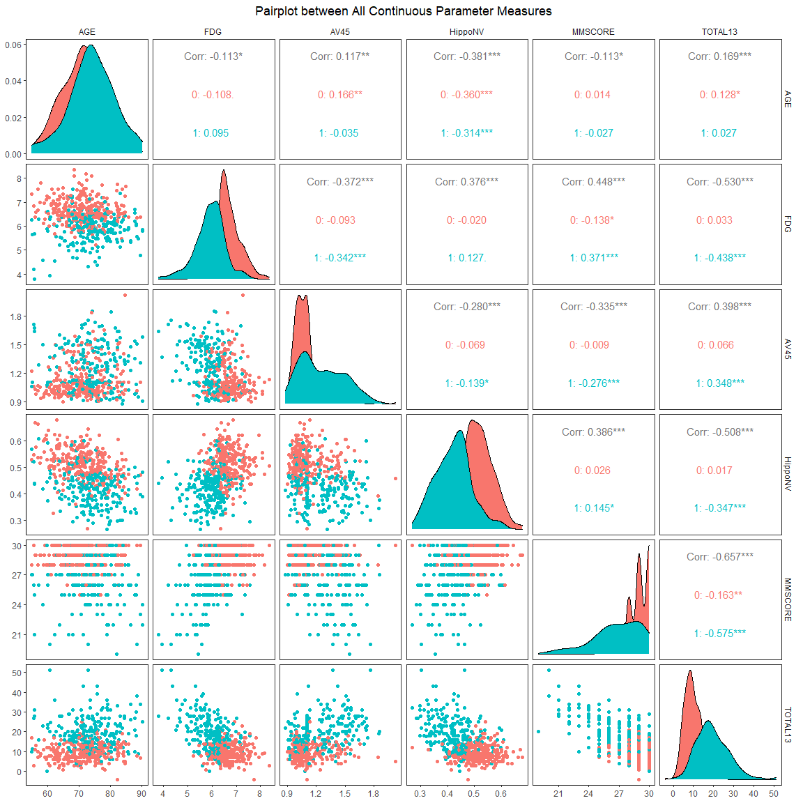

# Alzheimers Disease - Data Analysis
Here I have explored, analysed and fit an interpretable prediction Logistic Regression Model to explain the factors that contribute the most to Alzheimer's Disease. 

I have mainly focused on building the Logistic Regression Model, and have done the EDA mostly to see how the other factors measured for each individual interprets to a person having AD or not. The Model I came up with is really effective and explains the class predictions quite well.

**RUN**: The Finished Report can be seen in `Data-Analysis.html`(To be downloaded and opened in own browser, gives better experience), but one can view it right on Github through the `Data-Analysis.md` file. The supporting code that generated the file can be seen in `Data-Analysis.Rmd`(RMarkdown File). The Dataset used for this analysis was obtained from ADNI.
